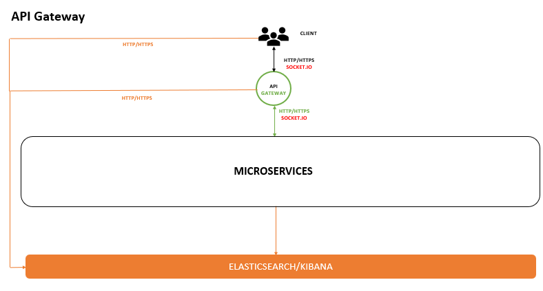

# 🌐 API Gateway Service

A production-ready **API Gateway Microservice** built with **Node.js, TypeScript, Express, Redis, Socket.IO, and Elasticsearch**, serving as the single entry point for all client requests in a distributed microservices architecture.

The API Gateway centralizes authentication, request validation, routing, real-time communication, error handling, and service orchestration, ensuring secure and scalable communication between frontend applications and backend microservices.

---

## 🚀 Project Overview

The API Gateway acts as the front door of the platform and is responsible for managing all incoming client requests.

Instead of allowing frontend applications to communicate directly with backend services, every request passes through the Gateway, where authentication, authorization, validation, routing, and error handling are performed.

The gateway follows a **Request/Response communication pattern** and provides a centralized layer for security, observability, and service coordination.

---

## ✨ Key Features

### 🔐 Authentication & Authorization

- JWT-based authentication
- Secure session management
- Request authorization middleware
- Protected route validation

### 🌍 Centralized Request Routing

- Single entry point for all client requests
- Routes requests to appropriate microservices
- Simplifies frontend integration

### ✅ Request Validation

- Input validation before forwarding requests
- Consistent API contract enforcement
- Reduced invalid traffic to backend services

### ⚡ Real-Time Communication

- Socket.IO integration
- Real-time event broadcasting
- WebSocket communication support

### 🚦 Error Handling

- Centralized client error management
- Consistent API response structure
- Improved debugging and observability

### 📊 Logging & Monitoring

- Elasticsearch integration for log storage
- Kibana dashboards for monitoring
- Centralized error tracking

### 🚀 Performance Optimization

- Redis caching support
- Reduced response times
- Improved scalability

### 🐳 Containerized Deployment

- Dockerized architecture
- Consistent deployment environments
- Simplified CI/CD integration

---

## 🏗️ Architecture

The Gateway acts as a centralized communication layer between clients and backend services.

```text
Client Applications
        │
        ▼
   API Gateway
        │
 ┌──────┼─────────────┬────────────┬────────────┐
 ▼      ▼             ▼            ▼            ▼
Auth  Users      Notification   Orders      Payments
Service Service    Service      Service      Service
```

---

## 🔄 Request Flow

1. Client sends request to API Gateway.
2. Gateway validates request payload.
3. JWT authentication is verified.
4. Request is routed to the appropriate microservice.
5. Response is returned to the client.
6. Errors are standardized and logged.
7. Operational logs are stored in Elasticsearch.
8. Metrics and logs are visualized in Kibana.

---

## 🛠️ Technology Stack

| Technology       | Purpose                    |
| ---------------- | -------------------------- |
| Node.js          | Backend Runtime            |
| Express.js       | API Framework              |
| TypeScript       | Type Safety                |
| Axios            | Service Communication      |
| Redis            | Caching Layer              |
| Socket.IO        | Real-Time Communication    |
| Socket.IO Client | WebSocket Client           |
| JWT              | Authentication             |
| Elasticsearch    | Log Storage                |
| Kibana           | Monitoring & Visualization |
| Docker           | Containerization           |

---

## 📊 Infrastructure Services

| Service       | URL                   | Purpose              |
| ------------- | --------------------- | -------------------- |
| Redis         | localhost:6379        | Cache Storage        |
| Elasticsearch | http://localhost:9200 | Log Storage          |
| Kibana        | http://localhost:5601 | Monitoring Dashboard |

---

## 📦 Local Development Setup

### 1. Clone Repository

```bash
git clone <repository-url>
cd gateway-service
```

---

### 2. Configure Shared Library

Ensure your shared library package is already published.

Copy the `.npmrc` file from your shared library project and configure:

```ini
//npm.pkg.github.com/:_authToken=<YOUR_PERSONAL_ACCESS_TOKEN>
```

If required, replace:

```text
@rayeeskha/jobber-shared
```

with your own shared library package name.

---

### 3. Install Dependencies

```bash
npm install
```

---

### 4. Configure Environment Variables

Copy:

```text
.env.dev
```

to:

```text
.env
```

Update all required environment variables.

#### JWT Configuration

Generate secure values for:

```env
JWT_TOKEN=
GATEWAY_JWT_TOKEN=
```

> Ensure the same JWT secrets are used across all microservices that require authentication.

#### Database Host

```env
DATABASE_HOST=<YOUR_MACHINE_IP>
```

Use your local machine IP address or server IP address.

---

### 5. Start the Service

```bash
npm run dev
```

---

## ⚙️ Environment Variables

Example configuration:

```env
PORT=4000

CLIENT_URL=http://localhost:3000

DATABASE_HOST=127.0.0.1

REDIS_HOST=localhost
REDIS_PORT=6379

ELASTIC_SEARCH_URL=http://localhost:9200

JWT_TOKEN=
GATEWAY_JWT_TOKEN=
```

---

## 📁 Project Structure

```text
src/
├── routes/
├── controllers/
├── services/
├── sockets/
├── middleware/
├── helpers/
├── config/
├── app.ts
└── server.ts
```

---

## 🔍 Monitoring & Observability

The API Gateway provides centralized monitoring capabilities:

- Elasticsearch log aggregation
- Kibana dashboards
- Request tracing
- Error monitoring
- Performance visibility
- Service health monitoring

---

## 🐳 Docker Deployment

### Build Docker Image

```bash
docker build --build-arg NPM_TOKEN=<YOUR_GITHUB_TOKEN> -t rayeeskhandev/jobber-gateway .
```

Example:

```bash
docker build --build-arg NPM_TOKEN=ghp_xxxxxxxxxxxxxxxxxxxxx -t rayeeskhandev/jobber-gateway .
```

---

### Tag Docker Image

```bash
docker tag rayeeskhandev/jobber-gateway rayeeskhandev/jobber-gateway:stable
```

Verify:

```bash
docker images
```

---

### Push Docker Image

```bash
docker push rayeeskhandev/jobber-gateway:stable
```

---

### Quick Commands

```bash
# Login
docker login

# Build
docker build --build-arg NPM_TOKEN=<YOUR_GITHUB_TOKEN> -t rayeeskhandev/jobber-gateway .

# Tag
docker tag rayeeskhandev/jobber-gateway rayeeskhandev/jobber-gateway:stable

# Push
docker push rayeeskhandev/jobber-gateway:stable
```

---

## 🎯 Engineering Highlights

- API Gateway Pattern Implementation
- JWT Authentication & Authorization
- Centralized Request Validation
- Redis-Based Performance Optimization
- Real-Time Communication with Socket.IO
- Elasticsearch & Kibana Monitoring Stack
- Scalable Microservices Architecture
- Dockerized Deployment Workflow
- Type-Safe Development with TypeScript

---



## 👨‍💻 Author

**Rayees Khan**

Backend Developer | Node.js | TypeScript | Microservices | Docker | Redis | RabbitMQ | Elasticsearch | AWS
