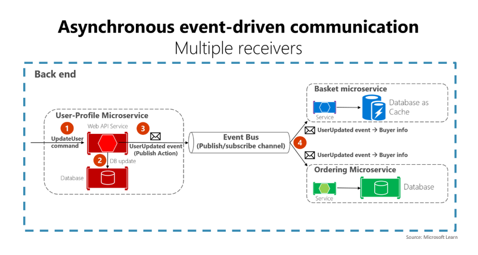
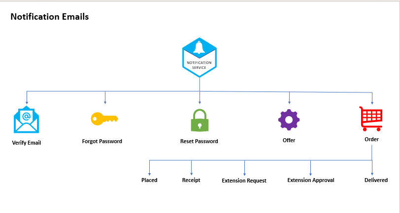

# 📩 Notification Service

A production-ready **Notification Microservice** built with **Node.js, TypeScript, RabbitMQ, Elasticsearch, and Kibana**, designed to handle asynchronous email delivery in a scalable, event-driven microservices architecture.

The service consumes notification events from RabbitMQ, generates dynamic email content using EJS templates, delivers emails through SMTP providers, and provides centralized logging and monitoring through Elasticsearch and Kibana.

---

## 🚀 Project Overview

The Notification Service is responsible for processing and delivering email notifications across the platform.

Instead of sending emails directly from business services, notification requests are published to RabbitMQ queues. The Notification Service consumes these messages asynchronously, generates the required email content, sends the email, and records operational logs for monitoring and troubleshooting.

This architecture improves:

- Scalability
- Reliability
- Fault tolerance
- System decoupling
- Performance of core business services

---

## ✨ Key Features

### 📬 Asynchronous Email Processing

- Consumes email events from RabbitMQ
- Non-blocking communication between services
- Supports high-volume notification workloads
- Improves application responsiveness

### ✉️ Email Delivery Service

- SMTP integration using Nodemailer
- Supports dynamic email generation
- Handles transactional email workflows

### 🧩 Dynamic Email Templates

- Template-based email generation using EJS
- Easy customization and maintenance
- Reusable email layouts

### 📊 Centralized Logging & Monitoring

- Application logs stored in Elasticsearch
- Log aggregation across environments
- Advanced search and filtering capabilities

### 📈 Observability

- Kibana dashboards for real-time monitoring
- Error tracking and troubleshooting
- Operational visibility into email processing

### 🐳 Containerized Deployment

- Dockerized application
- Consistent deployment across environments
- Simplified infrastructure management

---

## 🏗️ Architecture

The service follows an **event-driven architecture** where notifications are processed independently from business workflows.

```text
User Service / Business Service
            │
            ▼
       RabbitMQ Queue
            │
            ▼
   Notification Service
            │
   ┌────────┴────────┐
   ▼                 ▼
SMTP Provider   Elasticsearch
   │                 │
   ▼                 ▼
 Email User      Kibana Dashboard
```

---

## 🛠️ Technology Stack

| Technology    | Purpose                    |
| ------------- | -------------------------- |
| Node.js       | Backend Runtime            |
| Express.js    | Web Framework              |
| TypeScript    | Type Safety                |
| RabbitMQ      | Message Broker             |
| Nodemailer    | Email Delivery             |
| EJS           | Email Templates            |
| Elasticsearch | Log Storage                |
| Kibana        | Monitoring & Visualization |
| Docker        | Containerization           |

---

## 🐳 Infrastructure Services

| Service             | URL                    | Purpose              |
| ------------------- | ---------------------- | -------------------- |
| RabbitMQ Management | http://localhost:15672 | Queue Monitoring     |
| Elasticsearch       | http://localhost:9200  | Log Storage & Search |
| Kibana              | http://localhost:5601  | Log Visualization    |
| Ethereal Email      | https://ethereal.email | SMTP Testing         |

---

## 📦 Local Development Setup

### 1. Clone Repository

```bash
git clone <repository-url>
cd notification-service
```

### 2. Install Dependencies

```bash
npm install
```

### 3. Configure Environment Variables

Create a `.env` file:

```env
APP_PORT=3000

RABBITMQ_URL=amqp://localhost

ELASTICSEARCH_URL=http://localhost:9200

SMTP_HOST=smtp.ethereal.email
SMTP_PORT=587
SMTP_USER=<smtp-user>
SMTP_PASS=<smtp-password>
```

### 4. Start Infrastructure Services

```bash
docker compose up -d
```

### 5. Run Application

```bash
npm run dev
```

---

## 📁 Project Structure

```text
src/
├── emails/
│   ├── templates/
│   └── helpers/
│
├── queues/
│   ├── consumers/
│   └── connection.ts
│
├── services/
├── config/
├── app.ts
└── server.ts
```

---

## 📨 Email Processing Workflow

1. A business service publishes a notification event to RabbitMQ.
2. Notification Service consumes the event.
3. Email content is generated using EJS templates.
4. Nodemailer sends the email through the configured SMTP provider.
5. Success and error logs are stored in Elasticsearch.
6. Logs and metrics are visualized in Kibana.

---

## 📊 Monitoring & Logging

The service integrates with Elasticsearch and Kibana to provide:

- Centralized application logs
- Error monitoring
- Operational visibility
- Searchable log history
- Production troubleshooting support

---

## 🐳 Docker Deployment

### Build Image

```bash
docker build --build-arg NPM_TOKEN=<YOUR_GITHUB_TOKEN> -t rayeeskhandev/jobber-notification .
```

### Tag Image

```bash
docker tag rayeeskhandev/jobber-notification rayeeskhandev/jobber-notification:stable
```

### Push Image

```bash
docker push rayeeskhandev/jobber-notification:stable
```

### Quick Commands

```bash
docker login

docker build --build-arg NPM_TOKEN=<YOUR_GITHUB_TOKEN> -t rayeeskhandev/jobber-notification .

docker tag rayeeskhandev/jobber-notification rayeeskhandev/jobber-notification:stable

docker push rayeeskhandev/jobber-notification:stable
```

---

## 📷 Architecture Diagram

### System Architecture



### Notification Flow



---

## 🎯 Engineering Highlights

- Event-driven microservices architecture
- Asynchronous message processing using RabbitMQ
- Centralized logging with Elasticsearch
- Real-time observability through Kibana
- Template-driven email generation
- Dockerized deployment workflow
- Type-safe development with TypeScript
- Scalable and fault-tolerant design

---

## 👨‍💻 Author

**Rayees Khan**

Backend Developer | Node.js | TypeScript | Microservices | AWS | Docker | RabbitMQ | Elasticsearch
