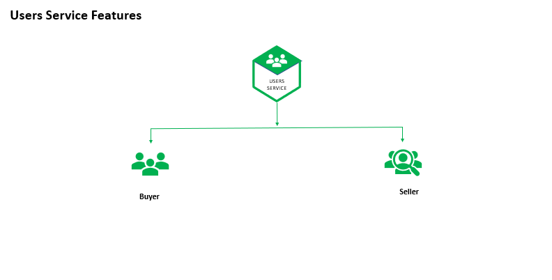

# 👥 Users Service

A production-ready **Users Microservice** built with **Node.js, TypeScript, MongoDB, RabbitMQ, and Elasticsearch**, responsible for managing buyers, sellers, user profiles, and user-related business operations within a distributed microservices architecture.

The service enables buyers to become sellers, manages profile information, processes user-related events, and provides seamless communication with other microservices through an event-driven architecture.

---

# 🚀 Project Overview

The Users Service acts as the central user management component of the platform.

It manages:

- Buyer profiles
- Seller profiles
- Seller onboarding
- User profile updates
- Seller dashboard information
- Event-driven communication with other services

The service consumes and publishes events through RabbitMQ, ensuring loose coupling and scalability across the system.

---

# 🎯 Business Responsibilities

The Users Service is responsible for:

- Managing buyer accounts
- Creating seller profiles
- Updating user information
- Managing seller profile data
- Providing seller dashboard information
- Publishing domain events
- Consuming events from other microservices
- Maintaining user-related business data

---

# ✨ Features

## 👤 Buyer Management

- Buyer profile creation
- Buyer information management
- Profile updates
- User account maintenance

## 🏪 Seller Management

- Buyer-to-seller conversion
- Seller profile creation
- Seller profile updates
- Seller dashboard support

## 📨 Event-Driven Communication

- RabbitMQ event publishing
- RabbitMQ event consumption
- Service-to-service communication
- Asynchronous processing

## 🗄️ MongoDB Integration

- Flexible document-based storage
- High-performance queries
- Scalable data management
- Mongoose ODM integration

## 📊 Logging & Monitoring

- Centralized logging with Elasticsearch
- Kibana dashboard integration
- Error monitoring and tracking
- Operational visibility

## 🌱 Development Support

- Faker-based seed data generation
- Local development environment
- Dockerized deployment

---

# 🏛️ Architecture Highlights

This service implements modern backend engineering patterns:

- Event-Driven Architecture
- Microservices Communication via RabbitMQ
- MongoDB Document-Based Data Modeling
- Centralized Logging & Monitoring
- Scalable User Management
- Dockerized Deployments
- Type-Safe Development with TypeScript

---

# 🔄 User Management Workflow

```text
Authentication Service
        │
        ▼
   RabbitMQ Event
        │
        ▼
     Users Service
        │
 ┌──────┴───────────┐
 ▼                  ▼
Buyer Profile   Seller Profile
 Creation         Creation
        │
        ▼
     MongoDB
        │
        ▼
 Elasticsearch
        │
        ▼
      Kibana
```



---

# 🛠️ Technology Stack

| Technology    | Purpose                    |
| ------------- | -------------------------- |
| Node.js       | Backend Runtime            |
| Express.js    | Web Framework              |
| TypeScript    | Type Safety                |
| MongoDB       | Database                   |
| Mongoose      | ODM                        |
| RabbitMQ      | Event Messaging            |
| JWT           | Authentication             |
| Elasticsearch | Log Storage                |
| Kibana        | Monitoring & Visualization |
| Faker         | Seed Data Generation       |
| Docker        | Containerization           |

---

# 📊 Infrastructure Services

| Service             | URL                    | Purpose              |
| ------------------- | ---------------------- | -------------------- |
| MongoDB             | localhost:27017        | User Data Storage    |
| RabbitMQ Management | http://localhost:15672 | Queue Monitoring     |
| Elasticsearch       | http://localhost:9200  | Log Storage & Search |
| Kibana              | http://localhost:5601  | Monitoring Dashboard |
| Cloudinary          | https://cloudinary.com | Media Storage        |

---

# 📦 Local Development Setup

## 1️⃣ Clone Repository

```bash
git clone <repository-url>
cd users-service
```

---

## 2️⃣ Configure Shared Library

Ensure your shared library package is already published.

Copy the `.npmrc` file from your shared library project and configure:

```ini
//npm.pkg.github.com/:_authToken=<YOUR_PERSONAL_ACCESS_TOKEN>
```

If required, replace:

```text
@rayeeskhha/jobber-shared
```

with your own shared library package name.

---

## 3️⃣ Install Dependencies

```bash
npm install
```

---

## 4️⃣ Configure Environment Variables

Copy:

```text
.env.dev
```

to:

```text
.env
```

### Cloudinary Configuration

Create an account at:

```text
https://cloudinary.com
```

Add:

```env
CLOUD_NAME=
CLOUD_API_KEY=
CLOUD_API_SECRET=
```

### JWT Configuration

Generate secure values for:

```env
JWT_TOKEN=
GATEWAY_JWT_TOKEN=
```

> Ensure the same JWT secrets are shared across all microservices that require authentication.

---

## 5️⃣ Run the Service

```bash
npm run dev
```

---

# ⚙️ Environment Variables

```env
PORT=4003

CLIENT_URL=http://localhost:3000

MONGODB_URL=mongodb://localhost:27017/jobber-users

RABBITMQ_ENDPOINT=amqp://localhost

ELASTIC_SEARCH_URL=http://localhost:9200

JWT_TOKEN=
GATEWAY_JWT_TOKEN=

CLOUD_NAME=
CLOUD_API_KEY=
CLOUD_API_SECRET=
```

---

# 📁 Project Structure

```text
src/
├── controllers/
├── services/
├── routes/
├── consumers/
├── producers/
├── database/
├── models/
├── seeds/
├── helpers/
├── middleware/
├── app.ts
└── server.ts
```

---

# 🔒 Security Features

- JWT-based authentication
- Protected user operations
- Request validation
- Secure service communication
- Authorization middleware
- Centralized identity validation

---

# 📈 Monitoring & Observability

The service provides centralized monitoring using Elasticsearch and Kibana.

Features include:

- Error tracking
- Log aggregation
- Operational visibility
- Searchable logs
- Production troubleshooting

---

# 🐳 Docker Deployment

## Login to Docker Hub

```bash
docker login
```

---

## Build Docker Image

```bash
docker build --build-arg NPM_TOKEN=<YOUR_GITHUB_TOKEN> -t rayeeskhandev/jobber-users .
```

---

## Tag Docker Image

```bash
docker tag rayeeskhandev/jobber-users rayeeskhandev/jobber-users:stable
```

---

## Push Docker Image

```bash
docker push rayeeskhandev/jobber-users:stable
```

---

## Quick Commands

```bash
docker login

docker build --build-arg NPM_TOKEN=<YOUR_GITHUB_TOKEN> -t rayeeskhandev/jobber-users .

docker tag rayeeskhandev/jobber-users rayeeskhandev/jobber-users:stable

docker push rayeeskhandev/jobber-users:stable
```

---

# 🚀 Engineering Highlights

- Designed and implemented a scalable Users Microservice
- Built buyer and seller management workflows
- Implemented RabbitMQ-based event-driven communication
- Integrated MongoDB using Mongoose ODM
- Established centralized logging with Elasticsearch
- Built monitoring capabilities using Kibana
- Dockerized the service for consistent deployments
- Developed using TypeScript for maintainability and type safety
- Followed microservices architecture best practices

---

# 👨‍💻 Author

**Rayees Khan**

Backend Developer specializing in:

- Node.js
- TypeScript
- Microservices Architecture
- MongoDB
- RabbitMQ
- Docker
- Elasticsearch
- Kibana
- AWS
- REST APIs
- System Design
