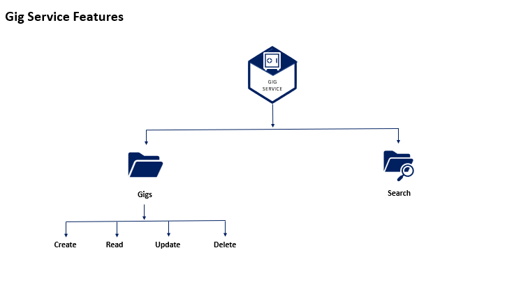

# 🎯 Gig Service

A production-ready **Gig Microservice** built with **Node.js, TypeScript, MongoDB, Elasticsearch, RabbitMQ, Redis, and Docker**, responsible for creating, managing, searching, and maintaining gig listings within a distributed microservices architecture.

The service provides high-performance gig management capabilities, leveraging Elasticsearch as the primary search and retrieval engine while maintaining data consistency across the platform through event-driven communication.

---

# 🚀 Project Overview

The Gig Service is responsible for managing seller-created gigs across the platform.

Sellers can create, update, retrieve, and delete gigs while users can discover services through powerful Elasticsearch-based search functionality.

The service follows an **Event-Driven Architecture**, enabling seamless communication with other microservices while maintaining scalability and high availability.

---

# 🎯 Business Responsibilities

The Gig Service handles:

- Gig creation and management
- Seller gig updates
- Gig deletion
- Full-text search and filtering
- Gig indexing in Elasticsearch
- Event publishing and consumption
- Search optimization
- Gig synchronization across services

---

# ✨ Features

## 🎨 Gig Management

- Create new gigs
- Update existing gigs
- Delete gigs
- Manage gig metadata
- Seller-specific gig operations

## 🔍 Advanced Search

- Elasticsearch-powered search
- Full-text search capabilities
- Fast query performance
- Search indexing and synchronization

## 📨 Event-Driven Communication

- RabbitMQ event publishing
- RabbitMQ event consumption
- Decoupled service communication
- Asynchronous processing

## ⚡ Performance Optimization

- Redis caching integration
- Reduced database load
- Improved response times
- Enhanced scalability

## 🗄️ Data Management

- MongoDB document storage
- Elasticsearch indexing
- Data synchronization
- High-performance read operations

## 📊 Logging & Monitoring

- Centralized logging with Elasticsearch
- Kibana dashboard integration
- Error monitoring and tracking
- Operational visibility

---

# 🏛️ Architecture Highlights

This service implements modern backend engineering patterns:

- Event-Driven Architecture
- CQRS-inspired Read Optimization
- Elasticsearch Search Engine Integration
- Redis Caching Layer
- MongoDB Document Storage
- RabbitMQ Messaging
- Dockerized Deployment
- Type-Safe Development with TypeScript

---

# 🔄 Gig Management Workflow

```text
Seller Creates Gig
        │
        ▼
     Gig Service
        │
 ┌──────┼─────────────┐
 ▼      ▼             ▼
MongoDB Elasticsearch RabbitMQ
Storage   Indexing     Events
        │
        ▼
      Redis
      Cache
        │
        ▼
 Elasticsearch Search
        │
        ▼
      Client
```



---

# 🛠️ Technology Stack

| Technology    | Purpose              |
| ------------- | -------------------- |
| Node.js       | Backend Runtime      |
| Express.js    | Web Framework        |
| TypeScript    | Type Safety          |
| MongoDB       | Data Storage         |
| Mongoose      | ODM                  |
| Elasticsearch | Search Engine        |
| Redis         | Caching              |
| RabbitMQ      | Event Messaging      |
| JWT           | Authentication       |
| Faker         | Seed Data Generation |
| Docker        | Containerization     |

---

# 📊 Infrastructure Services

| Service             | URL                    | Purpose              |
| ------------------- | ---------------------- | -------------------- |
| MongoDB             | localhost:27017        | Gig Storage          |
| Elasticsearch       | http://localhost:9200  | Search & Indexing    |
| Kibana              | http://localhost:5601  | Monitoring Dashboard |
| Redis               | localhost:6379         | Caching Layer        |
| RabbitMQ Management | http://localhost:15672 | Queue Monitoring     |
| Cloudinary          | https://cloudinary.com | Media Storage        |

---

# 📦 Local Development Setup

## 1️⃣ Clone Repository

```bash
git clone <repository-url>
cd gig-service
```

---

## 2️⃣ Configure Shared Library

Ensure your shared library package is already published.

Copy the `.npmrc` file from your shared library project and configure:

```ini
//npm.pkg.github.com/:_authToken=<YOUR_PERSONAL_ACCESS_TOKEN>
```

If required, replace:

```text
@rayeeskha/jobber-shared
```

with your own shared library package name.

---

## 3️⃣ Install Dependencies

```bash
npm install
```

---

## 4️⃣ Configure Environment Variables

Copy:

```text
.env.dev
```

to:

```text
.env
```

### Cloudinary Configuration

Create an account at:

```text
https://cloudinary.com
```

Add:

```env
CLOUD_NAME=
CLOUD_API_KEY=
CLOUD_API_SECRET=
```

### JWT Configuration

Generate secure values for:

```env
JWT_TOKEN=
GATEWAY_JWT_TOKEN=
```

> Ensure the same JWT secrets are shared across all microservices that require authentication.

---

## 5️⃣ Run the Service

```bash
npm run dev
```

---

# ⚙️ Environment Variables

```env
PORT=4004

CLIENT_URL=http://localhost:3000

MONGODB_URL=mongodb://localhost:27017/jobber-gig

ELASTIC_SEARCH_URL=http://localhost:9200

REDIS_HOST=localhost
REDIS_PORT=6379

RABBITMQ_ENDPOINT=amqp://localhost

JWT_TOKEN=
GATEWAY_JWT_TOKEN=

CLOUD_NAME=
CLOUD_API_KEY=
CLOUD_API_SECRET=
```

---

# 📁 Project Structure

```text
src/
├── controllers/
├── services/
├── routes/
├── consumers/
├── producers/
├── database/
├── models/
├── elasticsearch/
├── cache/
├── helpers/
├── middleware/
├── app.ts
└── server.ts
```

---

# 🔒 Security Features

- JWT-based authentication
- Request validation
- Protected seller operations
- Authorization middleware
- Secure service communication
- Centralized identity validation

---

# 📈 Monitoring & Observability

The service integrates with Elasticsearch and Kibana for centralized monitoring.

Features include:

- Error tracking
- Search analytics
- Log aggregation
- Performance monitoring
- Production troubleshooting

---

# 🐳 Docker Deployment

## Login to Docker Hub

```bash
docker login
```

---

## Build Docker Image

```bash
docker build --build-arg NPM_TOKEN=<YOUR_GITHUB_TOKEN> -t rayeeskhandev/jobber-gigs .
```

---

## Tag Docker Image

```bash
docker tag rayeeskhandev/jobber-gigs rayeeskhandev/jobber-gigs:stable
```

---

## Push Docker Image

```bash
docker push rayeeskhandev/jobber-gigs:stable
```

---

## Quick Commands

```bash
docker login

docker build --build-arg NPM_TOKEN=<YOUR_GITHUB_TOKEN> -t rayeeskhandev/jobber-gigs .

docker tag rayeeskhandev/jobber-gigs rayeeskhandev/jobber-gigs:stable

docker push rayeeskhandev/jobber-gigs:stable
```

---

# 🚀 Engineering Highlights

- Designed and implemented a scalable Gig Management Microservice
- Built Elasticsearch-powered search functionality
- Implemented RabbitMQ-based event-driven communication
- Integrated Redis for performance optimization
- Managed gig data using MongoDB and Mongoose
- Established centralized logging with Elasticsearch
- Built monitoring capabilities using Kibana
- Dockerized the service for consistent deployments
- Developed using TypeScript for maintainability and type safety
- Followed microservices architecture best practices

---

# 👨‍💻 Author

**Rayees Khan**

Backend Developer specializing in:

- Node.js
- TypeScript
- Microservices Architecture
- MongoDB
- Elasticsearch
- Redis
- RabbitMQ
- Docker
- AWS
- REST APIs
- System Design
