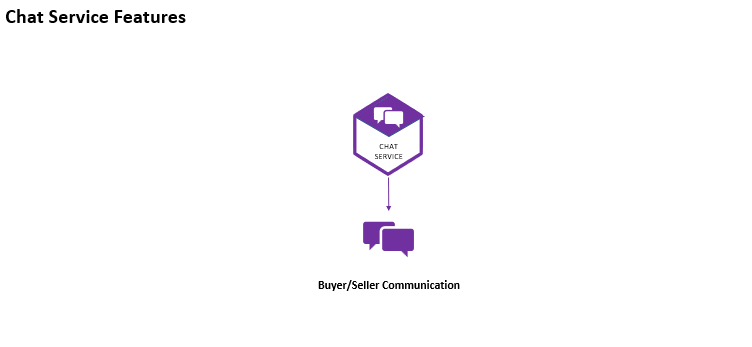

# 💬 Chat Service

A scalable **Chat Microservice** built with **Node.js, TypeScript, Socket.IO, MongoDB, RabbitMQ, Elasticsearch, and Docker**, responsible for enabling real-time communication between buyers and sellers within a distributed microservices architecture.

The service provides low-latency messaging, persistent chat storage, event-driven communication, and centralized monitoring to support seamless user interactions across the platform.

---

# 🚀 Project Overview

The Chat Service facilitates real-time conversations between buyers and sellers.

It manages message delivery, conversation history, user communication channels, and event publishing while maintaining high availability and scalability through a microservices architecture.

The service leverages **Socket.IO** for real-time bidirectional communication and **MongoDB** for persistent chat storage.

---

# 🎯 Business Responsibilities

The Chat Service handles:

- Real-time buyer-to-seller communication
- Real-time seller-to-buyer communication
- Message persistence
- Conversation management
- Event publishing to other microservices
- Chat history retrieval
- Online user communication

---

# ✨ Features

## 💬 Real-Time Messaging

- Instant message delivery
- WebSocket-based communication
- Low-latency interactions
- Bidirectional messaging

## 👥 Buyer & Seller Communication

- Buyer-to-seller messaging
- Seller-to-buyer messaging
- Conversation management
- Message history tracking

## 📨 Event-Driven Architecture

- RabbitMQ event publishing
- Asynchronous communication
- Decoupled microservices integration
- Reliable event processing

## 🗄️ Persistent Chat Storage

- MongoDB document storage
- Conversation history retention
- Message persistence
- Scalable data management

## 📊 Monitoring & Logging

- Centralized logging with Elasticsearch
- Kibana dashboard visualization
- Error tracking and monitoring
- Operational observability

## ⚡ High Performance

- Socket.IO real-time connections
- Efficient message delivery
- Scalable architecture
- Optimized communication channels

---

# 🏛️ Architecture Highlights

This service implements modern backend engineering patterns:

- Real-Time Communication Architecture
- Event-Driven Microservices
- WebSocket-Based Messaging
- MongoDB Document Storage
- RabbitMQ Messaging
- Centralized Logging & Monitoring
- Dockerized Deployments
- Type-Safe Development with TypeScript

---

# 🔄 Chat Workflow

```text
Buyer
   │
   ▼
Socket.IO Connection
   │
   ▼
Chat Service
   │
 ┌─┴─────────────┐
 ▼               ▼
MongoDB       RabbitMQ
Storage        Events
   │
   ▼
Elasticsearch
   │
   ▼
Kibana
   │
   ▼
Seller
```



---

# 🛠️ Technology Stack

| Technology    | Purpose                    |
| ------------- | -------------------------- |
| Node.js       | Backend Runtime            |
| Express.js    | Web Framework              |
| TypeScript    | Type Safety                |
| Socket.IO     | Real-Time Communication    |
| MongoDB       | Chat Storage               |
| Mongoose      | ODM                        |
| RabbitMQ      | Event Messaging            |
| JWT           | Authentication             |
| Elasticsearch | Log Storage                |
| Kibana        | Monitoring & Visualization |
| Docker        | Containerization           |

---

# 📊 Infrastructure Services

| Service             | URL                    | Purpose              |
| ------------------- | ---------------------- | -------------------- |
| MongoDB             | localhost:27017        | Chat Data Storage    |
| RabbitMQ Management | http://localhost:15672 | Queue Monitoring     |
| Elasticsearch       | http://localhost:9200  | Log Storage & Search |
| Kibana              | http://localhost:5601  | Monitoring Dashboard |

---

# 📦 Local Development Setup

## 1️⃣ Clone Repository

```bash
git clone <repository-url>
cd chat-service
```

---

## 2️⃣ Configure Shared Library

Ensure your shared library package is already published.

Copy the `.npmrc` file from your shared library project and configure:

```ini
//npm.pkg.github.com/:_authToken=<YOUR_PERSONAL_ACCESS_TOKEN>
```

If required, replace:

```text
@rayeeskha/jobber-shared
```

with your own shared library package name.

---

## 3️⃣ Install Dependencies

```bash
npm install
```

---

## 4️⃣ Configure Environment Variables

Copy:

```text
.env.dev
```

to:

```text
.env
```

Generate secure values for:

```env
JWT_TOKEN=
GATEWAY_JWT_TOKEN=
```

> Ensure the same JWT secrets are shared across all microservices that require authentication.

---

## 5️⃣ Run the Service

```bash
npm run dev
```

---

# ⚙️ Environment Variables

```env
PORT=4005

CLIENT_URL=http://localhost:3000

MONGODB_URL=mongodb://localhost:27017/jobber-chats

RABBITMQ_ENDPOINT=amqp://localhost

ELASTIC_SEARCH_URL=http://localhost:9200

JWT_TOKEN=
GATEWAY_JWT_TOKEN=
```

---

# 📁 Project Structure

```text
src/
├── controllers/
├── services/
├── routes/
├── consumers/
├── producers/
├── database/
├── models/
├── sockets/
├── helpers/
├── middleware/
├── app.ts
└── server.ts
```

---

# 🔒 Security Features

- JWT-based authentication
- Protected communication channels
- User authorization
- Secure WebSocket connections
- Request validation
- Secure service-to-service communication

---

# 📈 Monitoring & Observability

The service integrates with Elasticsearch and Kibana for centralized monitoring.

Features include:

- Error tracking
- Log aggregation
- Performance monitoring
- Real-time observability
- Production troubleshooting

---

# 🐳 Docker Deployment

## Login to Docker Hub

```bash
docker login
```

---

## Build Docker Image

```bash
docker build --build-arg NPM_TOKEN=<YOUR_GITHUB_TOKEN> -t rayeeskhandev/jobber-chats .
```

---

## Tag Docker Image

```bash
docker tag rayeeskhandev/jobber-chats rayeeskhandev/jobber-chats:stable
```

---

## Push Docker Image

```bash
docker push rayeeskhandev/jobber-chats:stable
```

---

## Quick Commands

```bash
docker login

docker build --build-arg NPM_TOKEN=<YOUR_GITHUB_TOKEN> -t rayeeskhandev/jobber-chats .

docker tag rayeeskhandev/jobber-chats rayeeskhandev/jobber-chats:stable

docker push rayeeskhandev/jobber-chats:stable
```

---

# 🚀 Engineering Highlights

- Designed and implemented a scalable real-time Chat Microservice
- Built Socket.IO-based bidirectional communication
- Implemented RabbitMQ event publishing
- Integrated MongoDB using Mongoose ODM
- Established centralized logging with Elasticsearch
- Built monitoring capabilities using Kibana
- Dockerized the service for consistent deployments
- Developed using TypeScript for maintainability and type safety
- Followed microservices architecture best practices

---

# 👨‍💻 Author

**Rayees Khan**

Backend Developer specializing in:

- Node.js
- TypeScript
- Microservices Architecture
- MongoDB
- RabbitMQ
- Socket.IO
- Elasticsearch
- Docker
- AWS
- REST APIs
- System Design
- Distributed Systems
- Event-Driven Architecture
