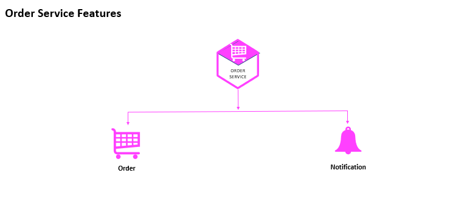

# 📦 Order Service

A production-ready **Order Microservice** built with **Node.js, TypeScript, MongoDB, RabbitMQ, Stripe, Socket.IO, Elasticsearch, and Docker**, responsible for managing buyer orders, seller order fulfillment, payment workflows, and order lifecycle operations within a distributed microservices architecture.

The service enables secure order processing, real-time status updates, event-driven communication, and seamless integration with payment systems while maintaining scalability and reliability.

---

# 🚀 Project Overview

The Order Service manages the complete order lifecycle between buyers and sellers.

It handles order creation, payment processing, order status updates, seller fulfillment workflows, and real-time notifications while coordinating with other microservices through an event-driven architecture.

The service integrates with Stripe for secure payment processing and Socket.IO for real-time communication.

---

# 🎯 Business Responsibilities

The Order Service handles:

- Buyer order creation
- Seller order management
- Order lifecycle tracking
- Payment processing
- Order status updates
- Real-time order notifications
- Event publishing and consumption
- Order fulfillment workflows

---

# ✨ Features

## 🛒 Order Management

- Create new orders
- Track order progress
- Manage order status
- Update order lifecycle stages
- Seller order fulfillment

## 💳 Payment Processing

- Stripe payment integration
- Secure payment workflows
- Payment verification
- Transaction tracking
- Payment status management

## 💬 Real-Time Updates

- Socket.IO integration
- Live order notifications
- Instant status updates
- Real-time communication

## 📨 Event-Driven Communication

- RabbitMQ event publishing
- RabbitMQ event consumption
- Asynchronous processing
- Decoupled service integration

## 🗄️ Persistent Data Storage

- MongoDB document storage
- Order history management
- Transaction records
- Scalable data architecture

## 📊 Logging & Monitoring

- Elasticsearch log aggregation
- Kibana dashboards
- Error monitoring
- Operational visibility

---

# 🏛️ Architecture Highlights

This service implements modern backend engineering patterns:

- Event-Driven Architecture
- Payment Gateway Integration
- Real-Time Communication
- MongoDB Document Storage
- RabbitMQ Messaging
- Centralized Logging & Monitoring
- Dockerized Deployment
- Type-Safe Development with TypeScript

---

# 🔄 Order Processing Workflow

```text
Buyer Places Order
        │
        ▼
    Order Service
        │
 ┌──────┼──────────────┐
 ▼      ▼              ▼
Stripe MongoDB     RabbitMQ
Payment Storage     Events
        │
        ▼
     Socket.IO
        │
        ▼
 Real-Time Updates
        │
        ▼
      Seller
```



---

# 🛠️ Technology Stack

| Technology    | Purpose                    |
| ------------- | -------------------------- |
| Node.js       | Backend Runtime            |
| Express.js    | Web Framework              |
| TypeScript    | Type Safety                |
| MongoDB       | Data Storage               |
| Mongoose      | ODM                        |
| RabbitMQ      | Event Messaging            |
| Stripe API    | Payment Processing         |
| Socket.IO     | Real-Time Communication    |
| JWT           | Authentication             |
| Elasticsearch | Log Storage                |
| Kibana        | Monitoring & Visualization |
| Docker        | Containerization           |

---

# 📊 Infrastructure Services

| Service             | URL                          | Purpose              |
| ------------------- | ---------------------------- | -------------------- |
| MongoDB             | localhost:27017              | Order Data Storage   |
| RabbitMQ Management | http://localhost:15672       | Queue Monitoring     |
| Elasticsearch       | http://localhost:9200        | Log Storage & Search |
| Kibana              | http://localhost:5601        | Monitoring Dashboard |
| Stripe Dashboard    | https://dashboard.stripe.com | Payment Management   |

---

# 📦 Local Development Setup

## 1️⃣ Clone Repository

```bash
git clone <repository-url>
cd order-service
```

---

## 2️⃣ Configure Shared Library

Ensure your shared library package is already published.

Copy the `.npmrc` file from your shared library project and configure:

```ini
//npm.pkg.github.com/:_authToken=<YOUR_PERSONAL_ACCESS_TOKEN>
```

Replace:

```text
@rayeeskha/jobber-shared
```

with your own shared library package name if applicable.

---

## 3️⃣ Install Dependencies

```bash
npm install
```

---

## 4️⃣ Configure Environment Variables

Copy:

```text
.env.dev
```

to:

```text
.env
```

### Stripe Configuration

Create a Stripe account:

```text
https://stripe.com
```

Add your Stripe API key:

```env
STRIPE_API_KEY=
```

### Cloudinary Configuration

Create a Cloudinary account:

```text
https://cloudinary.com
```

Add:

```env
CLOUD_NAME=
CLOUD_API_KEY=
CLOUD_API_SECRET=
```

### JWT Configuration

Generate secure values for:

```env
JWT_TOKEN=
GATEWAY_JWT_TOKEN=
```

> Use the same JWT secrets across all microservices that require authentication.

---

## 5️⃣ Run the Service

```bash
npm run dev
```

---

# ⚙️ Environment Variables

```env
PORT=4006

CLIENT_URL=http://localhost:3000

MONGODB_URL=mongodb://localhost:27017/jobber-orders

RABBITMQ_ENDPOINT=amqp://localhost

ELASTIC_SEARCH_URL=http://localhost:9200

STRIPE_API_KEY=

JWT_TOKEN=
GATEWAY_JWT_TOKEN=

CLOUD_NAME=
CLOUD_API_KEY=
CLOUD_API_SECRET=
```

---

# 📁 Project Structure

```text
src/
├── controllers/
├── services/
├── routes/
├── consumers/
├── producers/
├── database/
├── models/
├── payment/
├── sockets/
├── helpers/
├── middleware/
├── app.ts
└── server.ts
```

---

# 🔒 Security Features

- JWT-based authentication
- Secure payment processing
- Stripe payment validation
- Protected order operations
- Authorization middleware
- Secure service communication

---

# 📈 Monitoring & Observability

The service integrates with Elasticsearch and Kibana for centralized monitoring.

Features include:

- Error tracking
- Log aggregation
- Payment monitoring
- Performance analytics
- Production troubleshooting

---

# 🐳 Docker Deployment

## Login to Docker Hub

```bash
docker login
```

---

## Build Docker Image

```bash
docker build --build-arg NPM_TOKEN=<YOUR_GITHUB_TOKEN> -t rayeeskhandev/jobber-orders .
```

---

## Tag Docker Image

```bash
docker tag rayeeskhandev/jobber-orders rayeeskhandev/jobber-orders:stable
```

---

## Push Docker Image

```bash
docker push rayeeskhandev/jobber-orders:stable
```

---

## Quick Commands

```bash
docker login

docker build --build-arg NPM_TOKEN=<YOUR_GITHUB_TOKEN> -t rayeeskhandev/jobber-orders .

docker tag rayeeskhandev/jobber-orders rayeeskhandev/jobber-orders:stable

docker push rayeeskhandev/jobber-orders:stable
```

---

# 🚀 Engineering Highlights

- Designed and implemented a scalable Order Management Microservice
- Integrated Stripe for secure payment processing
- Built Socket.IO-based real-time order updates
- Implemented RabbitMQ event-driven communication
- Managed order data using MongoDB and Mongoose
- Established centralized logging with Elasticsearch
- Built monitoring capabilities using Kibana
- Dockerized the service for consistent deployments
- Developed using TypeScript for maintainability and type safety
- Followed microservices architecture best practices

---

# 👨‍💻 Author

**Rayees Khan**

Backend Developer specializing in:

- Node.js
- TypeScript
- Microservices Architecture
- MongoDB
- RabbitMQ
- Stripe Integration
- Socket.IO
- Elasticsearch
- Docker
- AWS
- REST APIs
- System Design
- Distributed Systems
