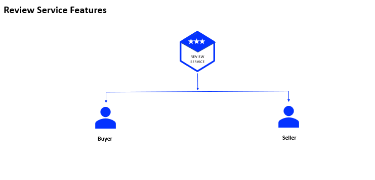

# ⭐ Review Service

A production-ready **Review Microservice** built with **Node.js, TypeScript, PostgreSQL, RabbitMQ, Socket.IO, Elasticsearch, and Docker**, responsible for managing buyer and seller reviews, ratings, and reputation data within a distributed microservices architecture.

The service enables users to submit reviews, maintain seller reputation scores, publish review-related events, and provide real-time review updates while ensuring scalability, reliability, and observability.

---

# 🚀 Project Overview

The Review Service manages the review and rating system across the platform.

It allows buyers and sellers to submit reviews, calculates reputation metrics, stores review data in PostgreSQL, and publishes events to other microservices for synchronization and business workflows.

The service supports real-time review updates and centralized monitoring through Elasticsearch and Kibana.

---

# 🎯 Business Responsibilities

The Review Service handles:

- Seller reviews
- Buyer reviews
- Rating management
- Reputation tracking
- Review publishing
- Review history management
- Real-time review notifications
- Event publishing to other services

---

# ✨ Features

## ⭐ Review Management

- Create reviews
- Update review information
- Retrieve review history
- Manage ratings and feedback
- Seller reputation tracking

## 📊 Rating System

- Buyer ratings
- Seller ratings
- Reputation calculation
- Feedback management
- Review analytics

## 📨 Event-Driven Communication

- RabbitMQ event publishing
- Asynchronous processing
- Service-to-service integration
- Decoupled architecture

## ⚡ Real-Time Updates

- Socket.IO integration
- Live review notifications
- Instant review updates
- Real-time communication

## 🗄️ PostgreSQL Data Storage

- Relational data management
- Structured review storage
- High-performance queries
- Data consistency

## 📈 Monitoring & Logging

- Elasticsearch log aggregation
- Kibana dashboards
- Error monitoring
- Operational observability

---

# 🏛️ Architecture Highlights

This service implements modern backend engineering patterns:

- Event-Driven Architecture
- Real-Time Communication
- PostgreSQL Relational Data Modeling
- RabbitMQ Messaging
- Centralized Logging & Monitoring
- Dockerized Deployments
- Type-Safe Development with TypeScript

---

# 🔄 Review Workflow

```text
Buyer / Seller
        │
        ▼
   Review Service
        │
 ┌──────┼─────────────┐
 ▼      ▼             ▼
PostgreSQL Socket.IO RabbitMQ
 Storage   Updates    Events
        │
        ▼
 Elasticsearch
        │
        ▼
     Kibana
```



---

# 🛠️ Technology Stack

| Technology    | Purpose                    |
| ------------- | -------------------------- |
| Node.js       | Backend Runtime            |
| Express.js    | Web Framework              |
| TypeScript    | Type Safety                |
| PostgreSQL    | Relational Database        |
| pg            | PostgreSQL Driver          |
| RabbitMQ      | Event Messaging            |
| Socket.IO     | Real-Time Communication    |
| JWT           | Authentication             |
| Elasticsearch | Log Storage                |
| Kibana        | Monitoring & Visualization |
| Docker        | Containerization           |

---

# 📊 Infrastructure Services

| Service             | URL                    | Purpose              |
| ------------------- | ---------------------- | -------------------- |
| PostgreSQL          | localhost:5432         | Review Data Storage  |
| RabbitMQ Management | http://localhost:15672 | Queue Monitoring     |
| Elasticsearch       | http://localhost:9200  | Log Storage & Search |
| Kibana              | http://localhost:5601  | Monitoring Dashboard |

---

# 📦 Local Development Setup

## 1️⃣ Clone Repository

```bash
git clone <repository-url>
cd review-service
```

---

## 2️⃣ Configure Shared Library

Ensure your shared library package is already published.

Copy the `.npmrc` file from your shared library project and configure:

```ini
//npm.pkg.github.com/:_authToken=<YOUR_PERSONAL_ACCESS_TOKEN>
```

If required, replace:

```text
@rayeeskha/jobber-shared
```

with your own shared library package name.

---

## 3️⃣ Install Dependencies

```bash
npm install
```

---

## 4️⃣ Configure Environment Variables

Copy:

```text
.env.dev
```

to:

```text
.env
```

Configure PostgreSQL:

```env
DATABASE_HOST=
DATABASE_PORT=5432
DATABASE_USER=
DATABASE_PASSWORD=
DATABASE_NAME=
```

### JWT Configuration

Generate secure values for:

```env
JWT_TOKEN=
GATEWAY_JWT_TOKEN=
```

> Use the same JWT secrets across all microservices requiring authentication.

---

## 5️⃣ Run the Service

```bash
npm run dev
```

---

# ⚙️ Environment Variables

```env
PORT=4007

CLIENT_URL=http://localhost:3000

DATABASE_HOST=
DATABASE_PORT=5432
DATABASE_USER=
DATABASE_PASSWORD=
DATABASE_NAME=

RABBITMQ_ENDPOINT=amqp://localhost

ELASTIC_SEARCH_URL=http://localhost:9200

JWT_TOKEN=
GATEWAY_JWT_TOKEN=
```

---

# 📁 Project Structure

```text
src/
├── controllers/
├── services/
├── routes/
├── producers/
├── database/
├── models/
├── sockets/
├── helpers/
├── middleware/
├── app.ts
└── server.ts
```

---

# 🔒 Security Features

- JWT-based authentication
- Protected review operations
- Authorization middleware
- Secure service communication
- Request validation
- Real-time connection security

---

# 📈 Monitoring & Observability

The service integrates with Elasticsearch and Kibana for centralized monitoring.

Features include:

- Error tracking
- Log aggregation
- Performance monitoring
- Review activity tracking
- Production troubleshooting

---

# 🐳 Docker Deployment

## Login to Docker Hub

```bash
docker login
```

---

## Build Docker Image

```bash
docker build --build-arg NPM_TOKEN=<YOUR_GITHUB_TOKEN> -t rayeeskhandev/jobber-reviews .
```

---

## Tag Docker Image

```bash
docker tag rayeeskhandev/jobber-reviews rayeeskhandev/jobber-reviews:stable
```

---

## Push Docker Image

```bash
docker push rayeeskhandev/jobber-reviews:stable
```

---

## Quick Commands

```bash
docker login

docker build --build-arg NPM_TOKEN=<YOUR_GITHUB_TOKEN> -t rayeeskhandev/jobber-reviews .

docker tag rayeeskhandev/jobber-reviews rayeeskhandev/jobber-reviews:stable

docker push rayeeskhandev/jobber-reviews:stable
```

---

# 🚀 Engineering Highlights

- Designed and implemented a scalable Review Management Microservice
- Built buyer and seller rating workflows
- Implemented RabbitMQ event publishing
- Integrated PostgreSQL using Node.js pg
- Built Socket.IO-based real-time review updates
- Established centralized logging with Elasticsearch
- Built monitoring capabilities using Kibana
- Dockerized the service for consistent deployments
- Developed using TypeScript for maintainability and type safety
- Followed microservices architecture best practices

---

# 👨‍💻 Author

**Rayees Khan**

Backend Developer specializing in:

- Node.js
- TypeScript
- Microservices Architecture
- PostgreSQL
- RabbitMQ
- Socket.IO
- Elasticsearch
- Docker
- AWS
- REST APIs
- System Design
