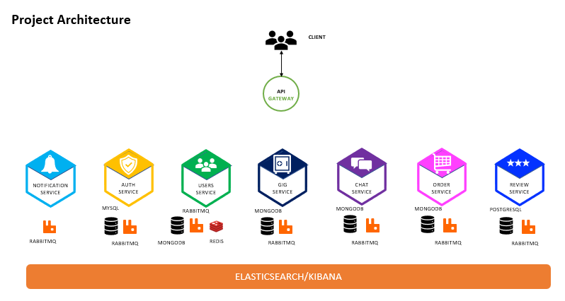

# Microservices Overview

The Jobber platform follows a Microservices Architecture pattern where each service is independently developed, deployed, and scaled.

Each service contains its own dedicated README file with setup instructions, API documentation, environment variables, database configuration, and deployment details.

---

## Service Architecture

```text
                           API Gateway
                                │
     ┌──────────────────────────┼──────────────────────────┐
     │                          │                          │
     ▼                          ▼                          ▼

 Auth Service            Users Service             Gig Service
     │                          │                          │
     └──────────────┬───────────┴───────────┬──────────────┘
                    │                       │
                    ▼                       ▼

              Order Service          Review Service
                    │
                    ▼

              Notification Service

                    ▲
                    │
              RabbitMQ Event Bus

                    │
                    ▼

                Chat Service
```

---

## Available Services

| Service | Description |
|----------|-------------|
| Gateway Service | Entry point for all client requests, routing, authentication, authorization, and API aggregation. |
| Auth Service | Handles authentication, JWT token generation, authorization, user sessions, and security-related operations. |
| Users Service | Manages user profiles, account settings, preferences, and user-related business logic. |
| Gig Service | Handles gig creation, management, searching, categorization, and marketplace functionality. |
| Chat Service | Provides real-time messaging, chat rooms, notifications, and communication features. |
| Order Service | Processes orders, payments, transactions, order tracking, and workflow management. |
| Review Service | Manages ratings, reviews, feedback, and reputation-related functionality. |
| Notification Service | Handles email, SMS, push notifications, and event-based communication. |
| Jobber Shared | Shared libraries, common utilities, interfaces, constants, event contracts, and reusable business components. |
| Jenkins Automation | CI/CD pipelines, Docker image builds, automated deployments, and infrastructure automation. |

---

## Repository Structure

```text
microservices/
│
├── 1-gateway-service/
│   └── README.md
│
├── 2-notification-service/
│   └── README.md
│
├── 3-auth-service/
│   └── README.md
│
├── 4-users-service/
│   └── README.md
│
├── 5-gig-service/
│   └── README.md
│
├── 6-chat-service/
│   └── README.md
│
├── 7-order-service/
│   └── README.md
│
├── 8-review-service/
│   └── README.md
│
├── 9-jobber-shared/
│   └── README.md
│
└── 10-jenkins-automation/
    └── README.md
```

---

## Communication Pattern

### Synchronous Communication

Used for request-response interactions between services through REST APIs.

```text
Client
   │
   ▼
API Gateway
   │
   ▼
Target Microservice
```

### Asynchronous Communication

Used for event-driven workflows through RabbitMQ.

```text
Order Service
      │
      ▼
 RabbitMQ
      │
      ▼
Notification Service

Notification Service
      │
      ▼
Email / SMS / Push Notifications
```

---

## Shared Infrastructure

All services may utilize one or more of the following infrastructure components:

| Component | Purpose |
|------------|----------|
| Redis | Caching, sessions, rate limiting |
| MongoDB | Document storage |
| MySQL | Relational data storage |
| PostgreSQL | Relational data storage |
| RabbitMQ | Event-driven messaging |
| Elasticsearch | Search and log storage |
| Kibana | Log visualization |
| Jenkins | CI/CD automation |
| Kubernetes | Container orchestration |

---

## Service Documentation

For detailed information about any service, navigate to the service directory and review its README file.

Example:

```bash
cd microservices/3-auth-service
```

```bash
cat README.md
```

Each service README includes:

- Project Overview
- Setup Instructions
- Environment Variables
- Database Configuration
- API Endpoints
- Docker Configuration
- Kubernetes Deployment
- Troubleshooting Guide


