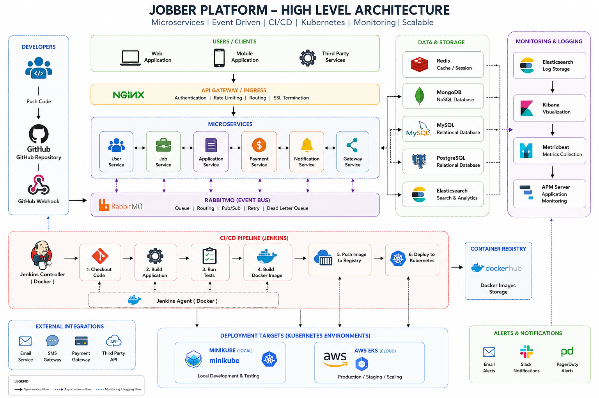

# Docker Setup Guide

This project uses Docker Compose to run all required infrastructure services including Redis, MongoDB, MySQL, PostgreSQL, RabbitMQ, Elasticsearch, Kibana,jenkins,jenkins-agent

---

## Prerequisites

Make sure the following are installed:

- Docker Desktop
- Docker Compose

Verify installation:

docker --version
docker compose version

---

## Start Services

Start all services in detached mode:

## Quick Commands

# First time

docker compose pull
docker compose build
docker compose up -d

# Later

docker compose up -d

#OR (fast dev mode):
docker compose up -d redis mongodb mysql postgres rabbitmq elasticsearch kibana metricbeat apmServer

docker compose up -d metricbeat

docker compose restart metricbeat

## Stop any service like this

## docker compose stop postgres

## Check Running Containers

docker ps

---

## Stop Services

docker compose down

---

## Clean Setup (Remove Volumes)

⚠️ This will delete all data (databases, queues, etc.)

docker compose down -v

---

## Services and Ports

Redis: localhost:6379  
MongoDB: localhost:27017  
MySQL: localhost:3307  
PostgreSQL: localhost:5432  
RabbitMQ UI: http://localhost:15672  
Elasticsearch: http://localhost:9200  
Kibana: http://localhost:5601

---

## RabbitMQ Credentials

Username: jobber  
Password: jobberpassword

---

## Logs

View all logs:

docker compose logs -f

View specific service logs:

docker compose logs -f <service-name>

Example:

docker compose logs -f elasticsearch

---

## Common Issues

Kibana not working:

- Ensure Elasticsearch is running
- Wait 20–40 seconds

Port already in use:

- Stop conflicting services
- Change ports in docker-compose.yml

Elasticsearch not starting:

- Allocate at least 4GB RAM to Docker

---

## Run Individual Services

docker compose up -d redis
docker compose up -d mongodb
docker compose up -d mysql
docker compose up -d postgres
docker compose up -d rabbitmq
docker compose up -d elasticsearch

Note: Elasticsearch may take 5–10 minutes to start.

---

## Kibana Setup

Update password:

curl -X POST -u elastic:admin1234 http://localhost:9200/\_security/user/kibana_system/\_password -H "Content-Type: application/json" -d '{"password":"kibana"}'

Generate token:

bin/elasticsearch-service-tokens create elastic/kibana jobber-kibana

Add to docker-compose:

ELASTICSEARCH_SERVICEACCOUNT_TOKEN=<your-token>

---

## Running Microservices

docker compose up -d

OR

npm run dev

Important: Start gateway service last.
---
---

